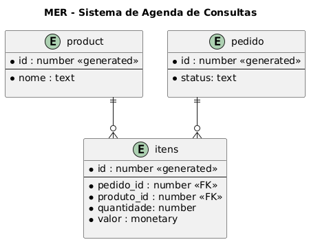

# Study APIR

API Java para estudo de Spring Boot

## Instalação

* Limpar e criar a pasta */target*

```
mvn clean package
```

* Configuração do Swagger

    - https://springdoc.org/properties.html

- application.properties

```
springdoc.swagger-ui.path=/
springdoc.swagger-ui.disable-swagger-default-url=true
```


## Navegação

### Executar a API

-  *Executando* **Maven**

```
mvn spring-boot:run
```

## MER



### Documentação da API (Swagger)
- http://localhost:8080/swagger-ui.html


## Referencias

- https://springdoc.org/

